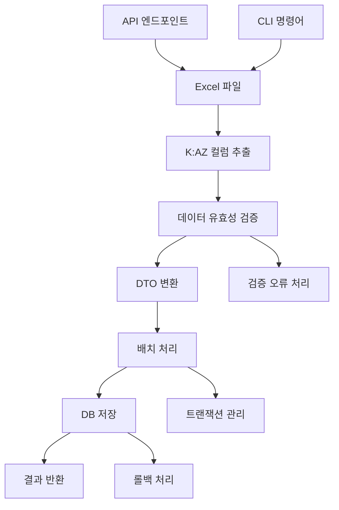

## 📋 프로세스 시각화

```
Excel 업로드/로컬 파일 → K:AZ 컬럼 데이터 추출 → 유효성 검증 → DTO 변환 → DB 저장 → 결과 반환 (API/CLI 지원)
```

## 🎯 개요

디자인업무일지 기반 상품등록 Excel 데이터를 자동으로 처리하여 데이터베이스에 저장하는 완전한 시스템을 구현했습니다. 계층별 분리, 비동기 처리, Pydantic 기반 유효성 검증을 통해 확장성과 안정성을 확보했습니다.

## 🔄 변경 사항

### 📝 Modified Files

|파일|변경 내용|
|---|---|
|`api/product_api.py`|상품등록 API 라우터 분리 및 include로 모듈화|


### ➕ Added Files

<details> <summary><strong>🔸 API Layer</strong></summary>

- **`api/product_registration_api.py`**
    - 상품등록 전용 RESTful API 엔드포인트
    - Excel 업로드/로컬파일 처리/CRUD/검색 기능
    - 파일 업로드 및 임시파일 처리 로직

</details> <details> <summary><strong>🔸 Model Layer</strong></summary>

- **`models/product/product_registration_data.py`**
    - PostgreSQL `product_registration_raw_data` 테이블 ORM 매핑
    - 23개 필드 정의 (제품명, 상품명, 이미지, 가격, 옵션 등)
    - SQLAlchemy 2.0 스타일 타입 힌트 적용


</details>

## 🏗️ 아키텍처 개선사항

### 1. **계층화된 설계 (Layered Architecture)**

```
API Layer → Service Layer → Repository Layer → Model Layer
     ↓           ↓              ↓              ↓
  FastAPI    비즈니스 로직    데이터 액세스    DB 매핑
```

### 2. **의존성 주입 패턴**

```python
async def get_product_registration_service(
    session: AsyncSession = Depends(get_async_session)
) -> ProductRegistrationService:
    return ProductRegistrationService(session)
```


## 🔧 주요 기능

### 📤 Excel 파일 처리

- **업로드 방식**: MultipartFile 업로드
- **로컬 파일**: 서버 내 파일 직접 처리
- **컬럼 범위**: K:AZ (인덱스 10-51) 전용 추출

## 📊 API 엔드포인트

|Method|Endpoint|설명|
|---|---|---|
|`POST`|`/api/product-registration/excel/import`|Excel 파일 업로드 및 DB 저장|

## 🎮 CLI 명령어
```bash
# 기본 사용법
python app.py import-product-registration-excel files/excel/product_registration_data_sample.xlsx

## 🔄 처리 플로우



## 🎯 관련 이슈

- **Issue**: #54 

## 🚀 사용 예시

### 1. CLI 사용

```bash
python app.py import-product-registration-excel files/excel/product_registration_data_sample.xlsx
```

### 2. API 사용

```bash
# 파일 업로드
curl -X POST "http://localhost:8000/api/product-registration/excel/import" \
     -H "Content-Type: multipart/form-data" \
     -F "file=@product_data.xlsx"

# 로컬 파일 처리
curl -X POST "http://localhost:8000/api/product-registration/local-excel/import?file_path=files/excel/product_registration_data_sample.xlsx"
```

## ⚠️ 다음 단계

1. **Excel 컬럼 매핑 확인**: 실제 Excel 파일의 K:AZ 컬럼명에 맞게 매핑 수정

## 🏆 기대 효과

- **자동화**: 수동 Excel 처리 작업 완전 자동화