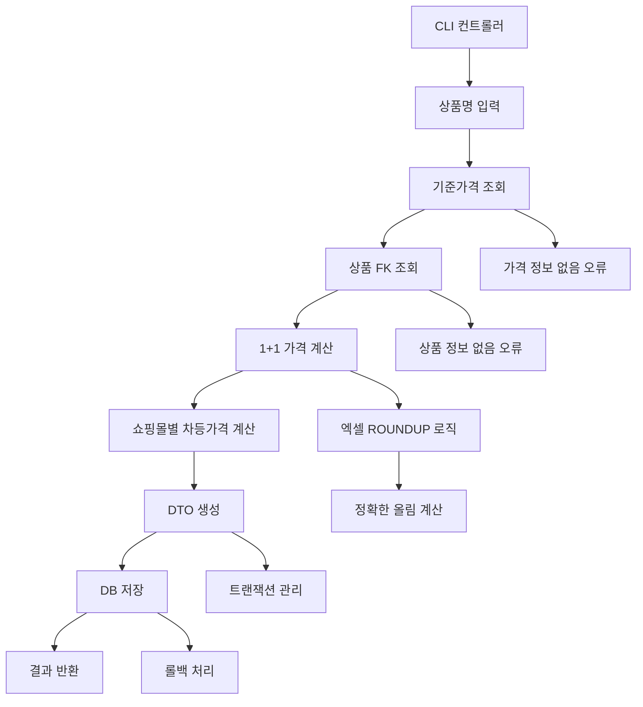

## 📋 프로세스 시각화

```
상품명 입력 → 기준가격 조회 → 1+1가격 계산 → 쇼핑몰별 차등가격 계산 → DB 저장 → 결과 반환 (CLI 지원)
```

## 🎯 개요

1+1 상품의 자동 가격 계산 시스템을 구현했습니다. 기준가격을 기반으로 1+1 가격을 계산하고, 28개 쇼핑몰별로 차등 가격을 적용하여 DB에 저장하는 완전한 시스템입니다. 계층별 분리, 비동기 처리, Decimal 기반 정확한 가격 계산을 통해 확장성과 안정성을 확보했습니다.

## 🔄 변경 사항

### 📝 Modified Files

|파일|변경 내용|
|---|---|
|`app.py`|1+1 가격 계산 CLI 명령어 추가|
|`repository/product_registration_repository.py`|상품 가격 조회 메서드 추가|
|`repository/product_repository.py`|모델명/몰구분 기반 상품 조회 메서드 추가|
|`utils/sabangnet_path_utils.py`|1+1 가격 계산 관련 경로 유틸리티 추가|
|`utils/product/price_calculator.py`|**엑셀 ROUNDUP 함수와 동일한 올림 로직 구현**|

### ➕ Added Files

<details> <summary><strong>🔸 Controller Layer</strong></summary>

- **`controller/one_one_price.py`**
    - 1+1 가격 계산 CLI 테스트 컨트롤러
    - 비동기 DB 세션 관리 및 서비스 연동
    - 계산 결과 출력 및 오류 처리 로직

</details>

<details> <summary><strong>🔸 Model Layer</strong></summary>

- **`models/product/price_calc/one_one_price_data.py`**
    - PostgreSQL `one_one_price_data` 테이블 ORM 매핑
    - 28개 쇼핑몰별 가격 필드 정의 (기준가격, 1+1가격 포함)
    - SQLAlchemy 2.0 스타일 타입 힌트 및 Decimal 정밀도 적용

</details>

<details> <summary><strong>🔸 Repository Layer</strong></summary>

- **`repository/product/price_calc/one_one_price_repository.py`**
    - 1+1 가격 데이터 CRUD 작업
    - 비동기 DB 세션 처리 및 트랜잭션 관리
    - DTO 기반 데이터 생성 및 조회

</details>

<details> <summary><strong>🔸 Service Layer</strong></summary>

- **`services/product/price_calc/one_one_price_service.py`**
    - 1+1 가격 계산 비즈니스 로직
    - 28개 쇼핑몰별 차등가격 계산 (115%, 105%, 동일가격, +100원)
    - Repository 계층 통합 및 전체 프로세스 관리

</details>

<details> <summary><strong>🔸 Schema Layer</strong></summary>

- **`schemas/product/price_calc/one_one_price_dto.py`**
    - 1+1 가격 데이터 전송 객체
    - Pydantic 기반 데이터 유효성 검증
    - 28개 쇼핑몰 가격 필드 정의

</details>

<details> <summary><strong>🔸 Utils Layer</strong></summary>

- **`utils/product/price_calculator.py`**
    - 1+1 가격 계산 핵심 로직
    - Decimal 기반 정밀한 가격 계산
    - **엑셀 ROUNDUP 함수와 동일한 천의자리 올림 로직 구현**
    - 퍼센트 적용, 고정금액 추가 계산

</details>

## 🏗️ 아키텍처 개선사항

### 1. **계층화된 설계 (Layered Architecture)**

```
Controller Layer → Service Layer → Repository Layer → Model Layer
     ↓                ↓              ↓              ↓
   CLI 테스트      비즈니스 로직    데이터 액세스    DB 매핑
```

### 2. **가격 계산 알고리즘 개선**

```python
# 1+1 가격 계산 (엑셀 ROUNDUP과 동일한 로직)
if 기준가 + 100 < 10000:
    roundup(기준가 * 2 + 2000, -3) - 100  # 11800 → 12000 → 11900
else:
    roundup(기준가 * 2 + 1000, -3) - 100
```

### 3. **엑셀 호환성 개선**

```python
# 기존 방식 (Python quantize)
value.quantize(Decimal('1000'), rounding=ROUND_UP)  # 11800 → 11800

# 새로운 방식 (엑셀 ROUNDUP과 동일)
math.ceil(float(value) / 1000) * 1000  # 11800 → 12000
```

## 🔧 주요 기능

### 💰 가격 계산 로직 개선

- **기준가격**: 상품등록 데이터에서 조회
- **1+1가격**: 기준가격 기반 조건부 계산
- **엑셀 호환성**: ROUNDUP 함수와 동일한 올림 로직 구현
- **쇼핑몰별 차등가격**: 4개 그룹으로 분류

### 🛒 쇼핑몰별 가격 정책

|그룹|계산방식|쇼핑몰 수|대표 쇼핑몰|
|---|---|---|---|
|**115% 그룹**|`roundup(1+1가격 * 1.15, -3) - 100`|8개|GS Shop, 텐바이텐, 롯데홈쇼핑|
|**105% 그룹**|`roundup(1+1가격 * 1.05, -3) - 100`|7개|YES24, 오늘의집, 브랜디|
|**동일가격 그룹**|`1+1가격 그대로`|11개|에이블리, 쿠팡, 토스쇼핑|
|**+100원 그룹**|`1+1가격 + 100`|5개|스마트스토어, 11번가, 옥션|

### 🔧 계산 정확성 개선

- **엑셀 호환성**: ROUNDUP 함수와 동일한 올림 로직으로 계산 정확성 보장
- **Decimal 정밀도**: 부동소수점 오차 방지
- **테스트 검증**: 실제 계산 결과 검증 완료

## 🎮 CLI 명령어

```bash
# 기본 사용법
python -c "
import asyncio
from controller.one_one_price import test_one_one_price_calculation
asyncio.run(test_one_one_price_calculation('상품명'))
"
```

## 🔄 처리 플로우



## 🎯 관련 이슈

- **Feature**: 1+1 상품 가격 자동 계산 시스템 구축
- **Fix**: 엑셀 ROUNDUP 함수와 동일한 올림 로직 구현

## 🚀 사용 예시

### 1. CLI 테스트

```bash
# Python 스크립트 실행
python -c "
import asyncio
from controller.one_one_price import test_one_one_price_calculation
asyncio.run(test_one_one_price_calculation('테스트상품명'))
"
```

### 2. 결과 출력 예시

```
🔄 '테스트상품명' 상품의 1+1 가격 계산 및 DB 저장 테스트 시작...
✅ DB 저장 성공!
📝 생성된 ID: 1
💰 기준가격: ₩4,900
🎯 1+1가격: ₩11,900 (11800 → 12000 → 11900)
🔗 FK: 123
🛒 GS Shop: ₩13,600
🛒 YES24: ₩12,400
🛒 쿠팡: ₩11,900
🛒 스마트스토어: ₩12,000
```

### 3. 가격 계산 검증

```python
# 기준가 4900원 테스트
기준가: 4900
기준가 * 2 + 2000: 11800
올림 후: 12000 (엑셀 ROUNDUP과 동일)
최종 결과: 11900 (12000 - 100)
```

## 🏆 기대 효과

- **자동화**: 수동 1+1 가격 계산 작업 완전 자동화
- **정확성**: 엑셀과 동일한 ROUNDUP 로직으로 계산 정확성 보장
- **확장성**: 쇼핑몰 추가 및 가격 정책 변경 용이
- **효율성**: 28개 쇼핑몰 가격을 한 번에 계산 및 저장