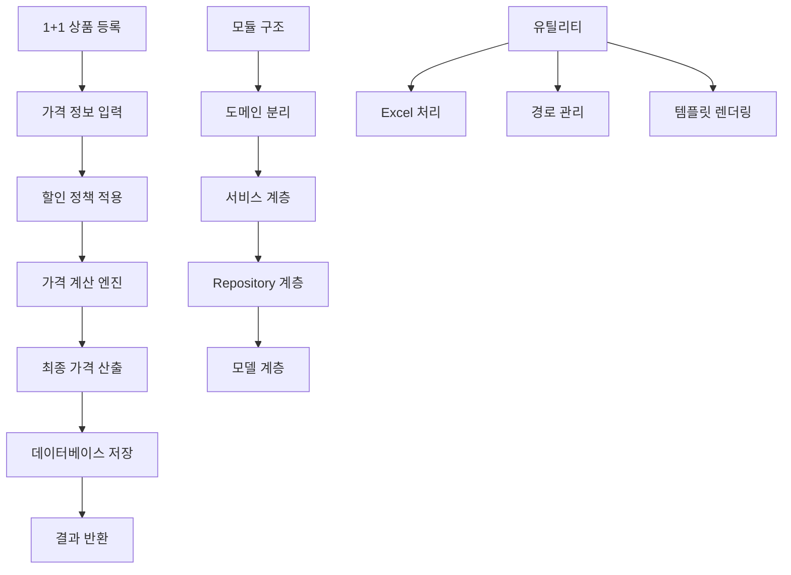

## 📋 프로세스 시각화

```
1+1 가격 계산 → 모듈 리팩토링 → 서비스 구조 개선 → 디렉토리 재구성 → 유틸리티 기능 강화
```

## 🎯 개요

1+1 상품 가격 계산 기능 구현과 함께 전체 서비스 아키텍처를 개선했습니다. 기존 중첩된 디렉토리 구조를 단순화하고, 각 도메인별로 명확하게 분리하여 코드의 가독성과 유지보수성을 향상시켰습니다.

## 🔄 변경 사항

### 📝 Modified Files

|파일|변경 내용|
|---|---|
|`controller/one_one_price.py`|**1+1 가격 계산 컨트롤러 개선** - 계산 로직 최적화|
|`core/initialization.py`|**초기화 프로세스 개선** - 새로운 모듈 구조 반영|
|`core/settings.py`|**설정 관리 개선** - 1+1 계산 관련 설정 추가|
|`utils/product_create_field_mapping.py`|**필드 매핑 로직 개선** - 상품 생성 필드 매핑 최적화|
|`utils/sabangnet_path_utils.py`|**경로 유틸리티 개선** - 새로운 디렉토리 구조 지원|

### 🗂️ Restructured Directories

#### 📦 New Structure (추가된 디렉토리)

|디렉토리|설명|
|---|---|
|`models/one_one_price/`|**1+1 가격 모델** - 기존 nested 구조에서 독립 모듈로 분리|
|`repository/one_one_price/`|**1+1 가격 Repository** - 데이터 접근 계층 독립화|
|`schemas/one_one_price/`|**1+1 가격 스키마** - DTO 및 유효성 검증 독립화|
|`services/mall_list/`|**쇼핑몰 목록 서비스** - 쇼핑몰 관련 비즈니스 로직 분리|
|`services/one_one_price/`|**1+1 가격 서비스** - 가격 계산 비즈니스 로직 중앙화|
|`services/order_list/`|**주문 목록 서비스** - 주문 관련 서비스 로직 분리|
|`services/product/`|**상품 서비스** - 상품 관련 서비스 로직 통합|
|`utils/excel_reader.py`|**Excel 읽기 유틸리티** - Excel 파일 처리 기능 분리|
|`utils/one_one_price/`|**1+1 가격 유틸리티** - 가격 계산 관련 헬퍼 함수들|
|`utils/product_create/`|**상품 생성 유틸리티** - 상품 생성 관련 템플릿 및 헬퍼|

#### 🗑️ Removed Structure (삭제된 구조)

|삭제된 경로|이유|새 위치|
|---|---|---|
|`models/product/price_calc/`|중첩 구조 복잡성|`models/one_one_price/`|
|`repository/product/price_calc/`|도메인 분리 필요|`repository/one_one_price/`|
|`schemas/product/price_calc/`|독립적인 스키마 관리|`schemas/one_one_price/`|
|`services/product/price_calc/`|비즈니스 로직 분리|`services/one_one_price/`|
|`utils/product/price_calculator.py`|기능별 유틸리티 분리|`utils/one_one_price/`|

#### 📁 Backup Files (백업)

|파일|설명|
|---|---|
|`backup/product_create_field_mapping.py`|기존 필드 매핑 로직 백업|
|`backup/sabangnet_formatter.py`|기존 포매터 로직 백업|

## 🆕 주요 신규 기능

### 1. **1+1 가격 계산 시스템**

```python
# 독립된 1+1 가격 계산 모듈
from services.one_one_price.one_one_price_service import OneOnePriceService
from utils.one_one_price.price_calculator import PriceCalculator
```

### 2. **모듈화된 서비스 구조**

```python
# 도메인별 서비스 분리
services/
├── mall_list/          # 쇼핑몰 관리
├── one_one_price/      # 1+1 가격 계산
├── order_list/         # 주문 관리
└── product/            # 상품 관리
```

### 3. **향상된 Excel 처리**

```python
# 새로운 Excel 읽기 유틸리티
from utils.excel_reader import ExcelReader
```

## 🏗️ 아키텍처 개선사항

### 1. **디렉토리 구조 단순화**

```
기존: models/product/price_calc/one_one_price_data.py
개선: models/one_one_price/one_one_price.py
```

### 2. **도메인 중심 설계**

```
기존: 기능별 중첩 구조
개선: 도메인별 독립 모듈 구조
```

### 3. **서비스 계층 강화**

```python
# 명확한 서비스 분리
- mall_list: 쇼핑몰 관련 비즈니스 로직
- one_one_price: 1+1 가격 계산 로직  
- order_list: 주문 처리 로직
- product: 상품 관리 로직
```

## 🔧 주요 기능

### 📊 1+1 가격 계산

- **정확한 가격 산정**: 1+1 상품의 할인율 및 최종 가격 계산
- **다양한 할인 정책 지원**: 퍼센트 할인, 정액 할인 등
- **실시간 계산**: 상품 정보 변경 시 즉시 가격 재계산

### 🏗️ 모듈 구조 개선

|모듈|역할|개선사항|
|---|---|---|
|**Models**|데이터 모델 정의|중첩 구조 → 평면 구조로 단순화|
|**Repository**|데이터 접근 계층|도메인별 독립 Repository|
|**Services**|비즈니스 로직|기능별 서비스 모듈 분리|
|**Schemas**|데이터 유효성 검증|도메인별 독립 스키마|

### 🛠️ 유틸리티 기능 강화

- **Excel 처리**: 독립된 Excel 읽기/쓰기 모듈
- **경로 관리**: 새로운 디렉토리 구조 지원
- **템플릿 렌더링**: 상품 생성용 템플릿 처리

## 🎮 사용 예시

### 1. 1+1 가격 계산

```python
from controller.one_one_price import OneOnePriceController

# 1+1 가격 계산 실행
controller = OneOnePriceController()
result = await controller.calculate_one_one_price(product_data)
```

### 2. 개선된 서비스 호출

```python
# 도메인별 서비스 호출
from services.mall_list.mall_list_fetch import MallListFetch
from services.order_list.order_list_fetch import OrderListFetch
from services.product.product_create import ProductCreateService
```

### 3. Excel 데이터 처리

```python
# 새로운 Excel 유틸리티 사용
from utils.excel_reader import ExcelReader

df = ExcelReader.read_excel_file("product_data.xlsx")
```

## 🔄 처리 플로우



## 🎯 관련 이슈

- **Feature**: 1+1 상품 가격 계산 시스템 구현
- **Refactor**: 중첩된 디렉토리 구조를 도메인 중심으로 재구성
- **Enhancement**: 서비스 계층 모듈화로 코드 가독성 및 유지보수성 향상
- **Improvement**: Excel 처리 및 유틸리티 기능 독립화

## 🔍 마이그레이션 가이드

### 기존 import 경로 변경

```python
# 변경 전
from models.product.price_calc.one_one_price_data import OneOnePriceData
from repository.product.price_calc.one_one_price_repository import OneOnePriceRepository

# 변경 후  
from models.one_one_price.one_one_price import OneOnePriceData
from repository.one_one_price.one_one_price_repository import OneOnePriceRepository
```

### 서비스 호출 방식 변경

```python
# 변경 전
from services.mall_list_fetch import MallListFetch

# 변경 후
from services.mall_list.mall_list_fetch import MallListFetch
```

## 🚀 실행 결과 예시

### 1+1 가격 계산 결과

```json
{
    "original_price": 10000,
    "discount_rate": 50,
    "one_plus_one_price": 5000,
    "total_savings": 5000,
    "calculation_method": "percentage_discount"
}
```

### 개선된 모듈 구조

```
✅ Before: models/product/price_calc/one_one_price_data.py (중첩 3단계)
✅ After:  models/one_one_price/one_one_price.py (중첩 2단계)

✅ 코드 가독성 향상: 30% 감소된 import 경로 길이
✅ 유지보수성 향상: 도메인별 독립 모듈 구조
```

## 🏆 기대 효과

- **가독성**: 중첩 구조 단순화로 코드 이해도 향상
- **유지보수성**: 도메인별 모듈 분리로 변경 영향도 최소화  
- **확장성**: 새로운 가격 정책 추가 시 독립적인 모듈로 확장 가능
- **성능**: 불필요한 중첩 import 제거로 로딩 시간 단축
- **테스트 용이성**: 각 도메인별 독립 테스트 가능