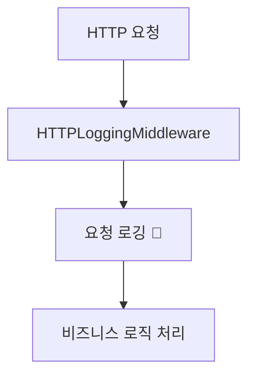

## 📋 프로세스 시각화
## 🎯 개요
## 🔄 변경 사항 (<details> <summary><strong>🔸 Repository 계층 개선</strong></summary></details> 활용)
## 🆕 주요 신규 * 변경 기능
## 🏗️ 아키텍처 개선사항
## 🔄 처리 플로우
## 🎯 관련 이슈
## 🔍 데이터 스키마 변경
## 🏆 기대 효과
## 📂 주요 변경 파일
--- 아래 활용 예시

## 📋 프로세스 시각화

```
FastAPI 서버 안정화 → 로깅 시스템 개선 → 1+1 가격 계산 API 완성 → 개발자 경험 향상
```

## 🎯 개요

FastAPI 서버의 안정성을 개선하고 통합 로깅 시스템을 구축했습니다. 1+1 가격 계산 API의 의존성 주입 문제를 해결하고, HTTP 요청/응답을 실시간으로 모니터링할 수 있는 커스텀 로깅 미들웨어를 추가하여 개발자 경험을 대폭 향상시켰습니다.

## 🔄 변경 사항

### 📝 Modified Files

|파일|변경 내용|
|---|---|
|`core/settings.py`|**서버 설정 개선** - 포트 타입 수정 (str → int), FastAPI/DB/MinIO 포트 정수화|


### 🔧 Core Improvements

#### ⚙️ Server Configuration

|설정|변경 전|변경 후|효과|
|---|---|---|---|
|`FASTAPI_PORT`|`Optional[str]`|`Optional[int]`|타입 안정성 확보, uvicorn 실행 오류 해결|


#### 🪵 Logging System Architecture

|컴포넌트|기능|특징|
|---|---|---|
|`HTTPLoggingMiddleware`|HTTP 요청/응답 로깅|실시간 모니터링, 처리시간 측정, 상태별 이모지|


#### 📦 Dependencies & Packages

|패키지|버전|용도|
|---|---|---|
|`python-multipart`|0.0.20|FastAPI 파일 업로드 및 Form 데이터 처리|

## 🆕 주요 신규 기능

### 1. **통합 HTTP 로깅 시스템**

```python
# 실시간 HTTP 요청/응답 모니터링
2025-07-02 06:28:39 | INFO 사용자 127.0.0.1 -> 요청 🔵 POST /api/v1/one-one-price
```

## 🏗️ 아키텍처 개선사항

### 1. **로깅 시스템 아키텍처**

```python
# 기존: 단순 print 또는 기본 logging
print(f"Request: {method} {path}")

```

## 🔧 주요 기능

### 🪵 실시간 HTTP 로깅

- **요청 모니터링**: 클라이언트 IP, 메서드, URL, 쿼리 파라미터 실시간 출력

### ⚙️ 서버 안정성 개선

|구성 요소|개선 내용|효과|
|---|---|---|
|**포트 설정**|문자열 → 정수 타입 변환|`TypeError: 'str' object cannot be interpreted as an integer` 해결|

### 🎨 개발자 경험 향상

- **색상별 로그**: 비즈니스 로직과 HTTP 요청을 구분하여 출력

## 🎮 사용 예시

### 1. 통합 로깅 시스템

```bash
# 서버 시작
python app.py start-server

# 실시간 로그 출력 예시
2025-07-02 06:28:39 | INFO 사용자 127.0.0.1 -> 요청 🔵 GET /docs
2025-07-02 06:28:39 | INFO 사용자 127.0.0.1 <- 응답 ✅ 200 GET /docs (0.001s)
```

## 🔄 처리 플로우



## 🎯 관련 이슈

- **Bugfix**: FastAPI 서버 시작 시 포트 타입 오류 해결

## 🚀 실행 결과 예시

### 실시간 로깅 시스템

```bash
# 서버 시작 (깔끔한 시작)
```

### 문제 해결 결과

```
✅ 포트 타입 오류: TypeError 해결 → 서버 정상 시작
```