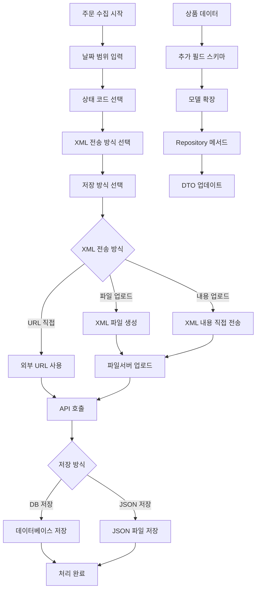

## 📋 프로세스 시각화
## 🎯 개요
## 🔄 변경 사항 (<details> <summary><strong>🔸 Repository 계층 개선</strong></summary></details> 활용)
## 🆕 주요 신규 * 변경 기능
## 🏗️ 아키텍처 개선사항
## 🔄 처리 플로우
## 🎯 관련 이슈
## 🔍 데이터 스키마 변경
## 🏆 기대 효과
## 📂 주요 변경 파일
--- 아래 활용 예시

## 📋 프로세스 시각화

```
상품 데이터 → 추가 필드 스키마 정의 → DB 모델 확장 → Repository 메서드 추가 → 주문 수집 기능 개선
```

## 🎯 개요

상품 데이터 모델에 필수 추가 필드들을 구현하고, 주문 수집 기능을 개선했습니다. 상품 관련 추가 메타데이터 필드들을 추가하여 더 풍부한 상품 정보 관리가 가능합니다.

## 🔄 변경 사항

### 📝 Modified Files

|파일|변경 내용|
|---|---|
|`controller/order_list.py`|**주문 수집 기능 대폭 개선** - DB 저장 옵션, 3가지 XML 전송 방식 지원|
|`models/product/modified_product_data.py`|**상품 모델 확장** - gubun, product_nm 등 5개 필드 추가|
|`models/product/product_raw_data.py`|**원본 상품 모델 확장** - 동일한 추가 필드 구조 적용|
|`repository/product_repository.py`|**Repository 메서드 추가** - 상품명+구분 기반 조회 기능|
|`schemas/product/modified_product_dto.py`|**DTO 스키마 확장** - 새로운 필드들에 대한 유효성 검증 추가|
|`schemas/product/product_raw_data_dto.py`|**DTO 스키마 확장** - 원본 데이터용 DTO 필드 추가|
|`services/product_create.py`|**상품 생성 서비스 개선** - XML 기반 상품 등록 로직 안정화|

## 🆕 주요 신규 기능

### 1. **상품 구분 관리 시스템**

```python
# gubun 필드를 통한 상품 구분
gubun: Mapped[str] = mapped_column(String(10))  # 마스터, 전문몰, 1+1 등 구분
```

### 2. **상품 메타데이터 확장**

```python
# 새로 추가된 필드들
product_nm: str      # 원본상품명 (60자)
no_product: str      # 상품번호 (30자)  
detail_img_url: str  # 상세이미지 확인 URL
no_word: str         # 글자수 (20자)
no_keyword: str      # 키워드 (20자)
```

### 3. **향상된 주문 수집 기능**

```python
# 3가지 XML 전송 방식 지원
1. XML 파일 업로드 후 URL 호출 (권장)
2. XML 내용 직접 업로드 후 URL 호출  
3. XML URL 직접 입력하여 호출

# DB 직접 저장 옵션
to_db = select_order_save_method()  # True: DB저장, False: JSON저장
```

## 🏗️ 아키텍처 개선사항

### 1. **데이터 모델 확장성 개선**

```
기존: 기본 상품 정보만 관리
개선: 상품 구분 + 메타데이터를 통한 세분화된 관리
```

### 2. **주문 수집 방식 다양화**

```
기존: 단일 XML 방식
개선: 3가지 XML 전송 방식 + DB/JSON 선택적 저장
```

### 3. **Repository 패턴 강화**

```python
# 새로운 조회 메서드
async def find_product_raw_data_by_product_nm_and_gubun(
    self, product_nm: str, gubun: str
) -> Optional[int]:
    """상품명과 구분으로 상품 ID 조회"""
```

## 🔧 주요 기능

### 📦 상품 필드 확장

- **gubun**: 상품 구분 관리 (마스터/전문몰/1+1)
- **product_nm**: 원본 상품명 저장
- **no_product**: 고유 상품번호 관리
- **detail_img_url**: 상세 이미지 URL 관리
- **no_word/no_keyword**: 상품 검색 최적화용 메타데이터

### 🚀 주문 수집 기능 개선

|방식|설명|장점|
|---|---|---|
|**파일 업로드**|XML 파일을 파일서버에 업로드 후 URL로 호출|안정성 높음, 추적 가능|
|**내용 업로드**|XML 내용을 직접 파일서버에 업로드|빠른 처리, 파일 생성 불필요|
|**URL 직접 입력**|외부 XML URL 직접 사용|기존 인프라 활용 가능|

### 💾 저장 방식 선택

- **DB 저장**: 즉시 데이터베이스에 저장하여 실시간 활용
- **JSON 저장**: 파일로 저장하여 후속 처리나 백업용으로 활용

## 🎮 사용 예시

### 1. 개선된 주문 수집 프로세스

```bash
# 주문 수집 실행
python -c "
from controller.order_list import fetch_order_list
fetch_order_list()
"
```

### 2. 상품 구분별 조회

```python
# Repository를 통한 상품 조회
product_id = await repository.find_product_raw_data_by_product_nm_and_gubun(
    product_nm="테스트상품", 
    gubun="1+1"
)
```

### 3. 확장된 필드 활용

```python
# 새로운 필드들이 포함된 상품 데이터
{
    "gubun": "마스터",
    "product_nm": "원본상품명",
    "no_product": "PRD001", 
    "detail_img_url": "https://example.com/detail.jpg",
    "no_word": "50",
    "no_keyword": "키워드1,키워드2"
}
```

## 🔄 처리 플로우



## 🎯 관련 이슈

- **Feature**: 상품 구분 관리를 위한 gubun 필드 추가
- **Feature**: 상품 메타데이터 확장 (product_nm, no_product 등)
- **Enhancement**: 주문 수집 방식 다양화 및 DB 직접 저장 옵션
- **Improvement**: Repository 패턴 강화로 조회 기능 확장

## 🔍 데이터 스키마 변경

### 추가된 필드들

```sql
-- test_product_raw_data 및 test_product_modified_data 테이블
ALTER TABLE test_product_raw_data ADD COLUMN gubun VARCHAR(10);
ALTER TABLE test_product_raw_data ADD COLUMN product_nm VARCHAR(60) NOT NULL;
ALTER TABLE test_product_raw_data ADD COLUMN no_product VARCHAR(30) NOT NULL;
ALTER TABLE test_product_raw_data ADD COLUMN detail_img_url TEXT NOT NULL;
ALTER TABLE test_product_raw_data ADD COLUMN no_word VARCHAR(20) NOT NULL;
ALTER TABLE test_product_raw_data ADD COLUMN no_keyword VARCHAR(20) NOT NULL;
```

## 🚀 실행 결과 예시

### 주문 수집 개선된 인터페이스

```
사방넷 주문수집
==================================================
주문수집일의 범위를 입력하세요 (예: 20250603~20250610)
일주일 이전의 날짜 범위 권장: 20250101~20250107

상태코드 목록
004    출고완료
006    배송보류
...

주문 수집 방법을 선택합니다.
1. 파일(XML) 업로드 후 URL로 호출 (권장)
2. XML 내용을 직접 업로드 후 URL로 호출
3. XML URL을 직접 입력하여 호출

선택하세요 (1, 2 또는 3): 1

주문 데이터 저장 방식을 선택하세요:
1. DB에 저장 (권장)
2. JSON 파일로 저장
선택하세요 (1 또는 2): 1

✅ 성공적으로 DB에 저장되었습니다.
```

## 🏆 기대 효과

- **확장성**: 상품 구분을 통한 체계적인 상품 관리
- **유연성**: 다양한 주문 수집 방식으로 상황별 최적 선택
- **효율성**: DB 직접 저장으로 실시간 데이터 활용
- **안정성**: 여러 XML 전송 방식으로 장애 상황 대응력 향상
- **추적성**: 상품 메타데이터 확장으로 더 정확한 상품 관리
