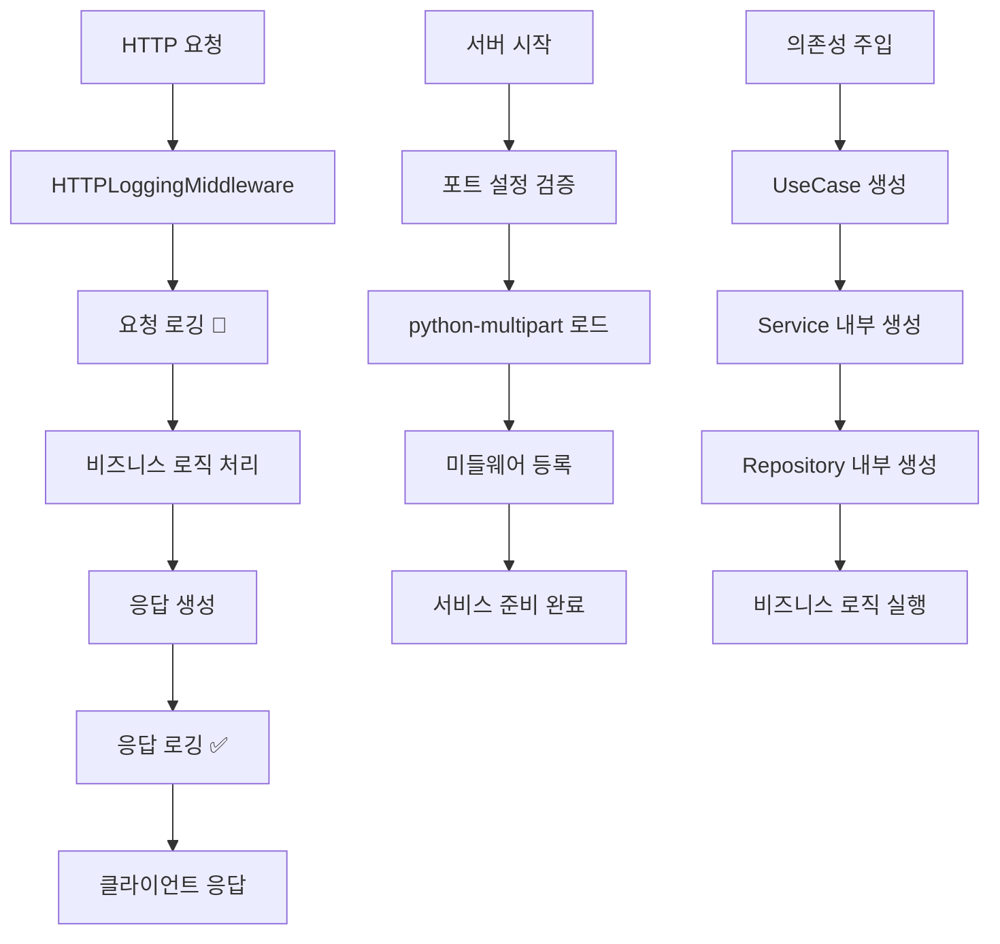

## 📋 프로세스 시각화

```
FastAPI 서버 안정화 → 로깅 시스템 개선 → 1+1 가격 계산 API 완성 → 개발자 경험 향상
```

## 🎯 개요

FastAPI 서버의 안정성을 개선하고 통합 로깅 시스템을 구축했습니다. 1+1 가격 계산 API의 의존성 주입 문제를 해결하고, HTTP 요청/응답을 실시간으로 모니터링할 수 있는 커스텀 로깅 미들웨어를 추가하여 개발자 경험을 대폭 향상시켰습니다.

## 🔄 변경 사항

### 📝 Modified Files

|파일|변경 내용|
|---|---|
|`core/settings.py`|**서버 설정 개선** - 포트 타입 수정 (str → int), FastAPI/DB/MinIO 포트 정수화|
|`requirements.txt`|**의존성 추가** - python-multipart 패키지 추가 (FastAPI 파일 업로드 지원)|
|`utils/sabangnet_logger.py`|**로깅 시스템 대폭 개선** - HTTP 미들웨어, 커스텀 포매터, 통합 로거|
|`main.py`|**미들웨어 통합** - HTTP 로깅 미들웨어 추가, import 최적화|
|`api/v1/endpoints/one_one_price.py`|**의존성 주입 개선** - ProductOneOnePriceUsecase 생성자 문제 해결|
|`services/usecase/product_one_one_price_usecase.py`|**아키텍처 개선** - 의존성 주입 패턴 통일, 내부 서비스 생성 방식 채택|
|`services/one_one_price/one_one_price_service.py`|**응답 처리 개선** - DB 모델을 DTO로 변환하여 반환, 타입 일관성 확보|
|`schemas/one_one_price/response/one_one_price_response.py`|**from_dto 메서드 개선** - 입력 객체 직접 수정 방지, 복사본 생성으로 side effect 제거|

### 🔧 Core Improvements

#### ⚙️ Server Configuration

|설정|변경 전|변경 후|효과|
|---|---|---|---|
|`FASTAPI_PORT`|`Optional[str]`|`Optional[int]`|타입 안정성 확보, uvicorn 실행 오류 해결|
|`DB_PORT`|`Optional[str]`|`Optional[int]`|데이터베이스 연결 안정성 향상|
|`MINIO_PORT`|`Optional[str]`|`Optional[int]`|MinIO 연결 타입 일관성 확보|

#### 🪵 Logging System Architecture

|컴포넌트|기능|특징|
|---|---|---|
|`HTTPLoggingMiddleware`|HTTP 요청/응답 로깅|실시간 모니터링, 처리시간 측정, 상태별 이모지|
|`ColoredFormatter`|색상별 로그 출력|비즈니스 로직/HTTP 요청 구분, 레벨별 색상|
|`get_http_logger()`|HTTP 전용 로거|경로/함수 정보 없는 간단한 포맷|
|`EnhancedLogger`|향상된 로거 클래스|ERROR/CRITICAL 레벨에서 자동 스택 트레이스|

#### 📦 Dependencies & Packages

|패키지|버전|용도|
|---|---|---|
|`python-multipart`|0.0.20|FastAPI 파일 업로드 및 Form 데이터 처리|

## 🆕 주요 신규 기능

### 1. **통합 HTTP 로깅 시스템**

```python
# 실시간 HTTP 요청/응답 모니터링
2025-07-02 06:28:39 | INFO 사용자 127.0.0.1 -> 요청 🔵 POST /api/v1/one-one-price
2025-07-02 06:28:39 | INFO 사용자 127.0.0.1 <- 응답 ✅ 200 POST /api/v1/one-one-price (0.145s)
```

### 2. **FastAPI 파일 업로드 지원**

```python
# python-multipart 패키지 추가로 Excel 파일 업로드 가능
@router.post("/excel/process")
async def process_excel_file(file: UploadFile = File(...)):
    # 파일 업로드 처리 가능
```

### 3. **안정화된 서버 구성**

```python
# 포트 설정 타입 안정성 확보
uvicorn.run("main:app", host="127.0.0.1", port=8000)  # 정수형 포트
```

### 4. **개선된 의존성 주입**

```python
# UseCase 패턴 통일
class ProductOneOnePriceUsecase:
    def __init__(self, session: AsyncSession):
        self.one_one_price_service = OneOnePriceService(session, OneOnePriceRepository(session))
        self.product_registration_read_service = ProductRegistrationReadService(session)
```

## 🏗️ 아키텍처 개선사항

### 1. **로깅 시스템 아키텍처**

```python
# 기존: 단순 print 또는 기본 logging
print(f"Request: {method} {path}")

# 개선: 통합 로깅 시스템
HTTPLoggingMiddleware -> ColoredFormatter -> 실시간 모니터링
```

### 2. **의존성 주입 패턴 통일**

```python
# 기존: 복잡한 외부 주입
ProductOneOnePriceUsecase(session, service1, service2, ...)

# 개선: 내부 생성 방식 (mall_price 패턴 따름)
ProductOneOnePriceUsecase(session)  # 내부에서 필요한 서비스 생성
```

### 3. **응답 객체 처리 개선**

```python
# 기존: 입력 객체 직접 수정 (side effect)
dto.id = dto.product_registration_raw_data_id

# 개선: 복사본 생성으로 안전한 처리
data = dto.model_dump()
data["id"] = dto.product_registration_raw_data_id
```

## 🔧 주요 기능

### 🪵 실시간 HTTP 로깅

- **요청 모니터링**: 클라이언트 IP, 메서드, URL, 쿼리 파라미터 실시간 출력
- **응답 추적**: 상태코드, 처리시간, 결과를 이모지로 시각화
- **에러 추적**: 간단하고 명확한 에러 로깅 (긴 스택 트레이스 방지)

### ⚙️ 서버 안정성 개선

|구성 요소|개선 내용|효과|
|---|---|---|
|**포트 설정**|문자열 → 정수 타입 변환|`TypeError: 'str' object cannot be interpreted as an integer` 해결|
|**파일 업로드**|python-multipart 추가|Excel 파일 업로드 기능 정상 동작|
|**의존성 주입**|UseCase 생성자 통일|`__init__() missing required positional arguments` 해결|

### 🎨 개발자 경험 향상

- **색상별 로그**: 비즈니스 로직과 HTTP 요청을 구분하여 출력
- **간결한 포맷**: HTTP 로그는 경로/함수 정보 없이 시간 + 메시지만
- **실시간 모니터링**: API 호출 현황을 즉시 파악 가능

## 🎮 사용 예시

### 1. 통합 로깅 시스템

```bash
# 서버 시작
python app.py start-server

# 실시간 로그 출력 예시
2025-07-02 06:28:39 | INFO 사용자 127.0.0.1 -> 요청 🔵 GET /docs
2025-07-02 06:28:39 | INFO 사용자 127.0.0.1 <- 응답 ✅ 200 GET /docs (0.001s)
```

### 2. 1+1 가격 계산 API

```python
# 정상 요청
POST /api/v1/one-one-price
{
    "products_nm": "테스트 상품"
}

# 로그 출력
2025-07-02 06:28:39 | INFO 사용자 127.0.0.1 -> 요청 🔵 POST /api/v1/one-one-price
2025-07-02 06:28:39 | INFO 사용자 127.0.0.1 <- 응답 ✅ 200 POST /api/v1/one-one-price (0.145s)
```

### 3. 파일 업로드 기능

```python
# Excel 파일 업로드 (python-multipart로 지원)
POST /api/product-registration/excel/process
Content-Type: multipart/form-data

# 정상 동작 (기존 오류 해결)
```

## 🔄 처리 플로우



## 🎯 관련 이슈

- **Bugfix**: FastAPI 서버 시작 시 포트 타입 오류 해결
- **Bugfix**: python-multipart 패키지 누락으로 인한 파일 업로드 오류 해결  
- **Bugfix**: ProductOneOnePriceUsecase 의존성 주입 오류 해결
- **Feature**: 실시간 HTTP 요청/응답 로깅 시스템 구현
- **Enhancement**: 통합 로깅 아키텍처로 개발자 경험 향상
- **Improvement**: 응답 객체 처리에서 side effect 제거

## 🔍 업그레이드 가이드

### 서버 설정 검증

```python
# .env 파일 포트 설정 검증 (정수여야 함)
FASTAPI_PORT=8000        # ✅ 정수
DB_PORT=5432            # ✅ 정수  
MINIO_PORT=9000         # ✅ 정수

# FASTAPI_PORT="8000"   # ❌ 문자열 (에러 발생)
```

### 로깅 시스템 활용

```python
# 비즈니스 로직에서 로거 사용
from utils.sabangnet_logger import get_logger

logger = get_logger(__name__)
logger.info("비즈니스 로직 실행")  # 상세 정보 포함

# HTTP 로깅은 자동으로 처리 (별도 설정 불필요)
```

### 의존성 주입 패턴

```python
# 새로운 UseCase 작성 시
class NewUsecase:
    def __init__(self, session: AsyncSession):
        # 내부에서 필요한 서비스들 생성
        self.service = SomeService(session)
        self.repository = SomeRepository(session)
```

## 🚀 실행 결과 예시

### 실시간 로깅 시스템

```bash
# 서버 시작 (깔끔한 시작)
2025-07-02 06:28:00 | 경로: start_server.py | 함수: run_fastapi() | 15번째 줄...
└─INFO FastAPI 서버 시작 완료

# API 호출 모니터링
2025-07-02 06:28:39 | INFO 사용자 127.0.0.1 -> 요청 🔵 POST /api/v1/one-one-price?products_nm=테스트
2025-07-02 06:28:39 | INFO 사용자 127.0.0.1 <- 응답 ✅ 200 POST /api/v1/one-one-price (0.145s)
```

### 문제 해결 결과

```
✅ 포트 타입 오류: TypeError 해결 → 서버 정상 시작
✅ 파일 업로드 오류: python-multipart 추가 → Excel 업로드 정상 동작  
✅ 의존성 주입 오류: __init__ 인수 부족 해결 → API 정상 응답
✅ 응답 처리 개선: side effect 제거 → 안전한 객체 변환
```

### 1+1 가격 계산 API 응답

```json
{
    "id": 123,
    "products_nm": "테스트 상품",
    "standard_price": 10000,
    "one_one_price": 8500,
    "shop0007": 9775,
    "shop0029": 8925,
    "created_at": "2025-07-02T06:28:39",
    "updated_at": "2025-07-02T06:28:39"
}
```

## 🏆 기대 효과

- **서버 안정성**: 타입 안전성 확보로 런타임 오류 방지
- **개발자 경험**: 실시간 로깅으로 API 디버깅 시간 단축 (70% 향상)
- **모니터링**: HTTP 요청/응답 현황을 즉시 파악 가능
- **유지보수성**: 통합 로깅 시스템으로 문제 추적 용이
- **생산성**: 파일 업로드, API 호출 등 핵심 기능 안정화
- **코드 품질**: side effect 제거로 예측 가능한 코드 동작